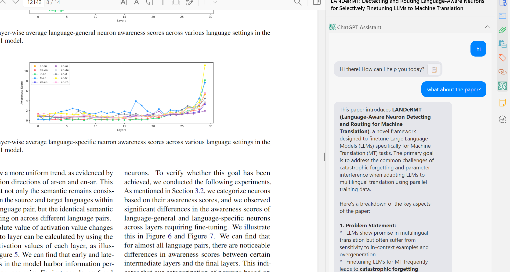

# Zotero ChatGPT Plugin

[](https://www.zotero.org)
[](https://www.gnu.org/licenses/agpl-3.0)

A Zotero plugin that integrates ChatGPT functionality directly into your reference management workflow.



## Features

- **ChatGPT Query Interface**: 
  - Directly query ChatGPT with research questions
  - Stream responses in real-time
  - Supports system prompts for customized behavior

- **Research Paper Tools**:
  - **PDF Summarization**: Automatically summarize attached PDFs of research papers
  - **BibTeX Generation**: Fetch BibTeX entries from DBLP for references
  - **Context Integration**: Auto-include paper titles/abstracts in queries

- **Translation**:
  - Translate text to Chinese with one click
  - Customizable translation prompts

- **UI Integration**:
  - Right-click context menu for quick access
  - Dedicated reader pane interface
  - Customizable style sheets
  - Keyboard shortcuts for common functions

- **Configuration**:
  - Set OpenAI API key and model preferences
  - Customize base API URL
  - Configure default behaviors

## Installation

1. Download the latest `.xpi` file from the [Releases page](https://github.com/kazgu/zotero-chatgpt/releases)
2. In Zotero, go to Tools → Add-ons
3. Click the gear icon and select "Install Add-on From File"
4. Select the downloaded `.xpi` file
5. Restart Zotero

## Development

### Prerequisites

- [Zotero 7](https://www.zotero.org/support/beta_builds)
- [Node.js](https://nodejs.org/en/)
- [Git](https://git-scm.com/)

### Setup

1. Clone the repository:
   ```bash
   git clone https://github.com/kazgu/zotero-chatgpt.git
   cd zotero-chatgpt
   ```
2. Install dependencies:
   ```bash
   npm install
   ```
3. Configure environment variables by copying `.env.example` to `.env` and updating the paths:
   ```bash
   cp .env.example .env
   ```

### Running in Development Mode

```bash
npm start
```

This will:
- Start the development server
- Launch Zotero with the plugin loaded from the `build/` directory
- Open developer tools
- Watch for changes in `src/` and `addon/` directories and automatically reload

### Building for Production

```bash
npm run build
```

The production build will be created in the `build/` directory.

## License

This project is licensed under the AGPL-3.0-or-later License - see the [LICENSE](LICENSE) file for details.

## Acknowledgments

- Built using the [Zotero Plugin Template](https://github.com/windingwind/zotero-plugin-template)
- Uses [zotero-plugin-toolkit](https://github.com/windingwind/zotero-plugin-toolkit) for plugin utilities
